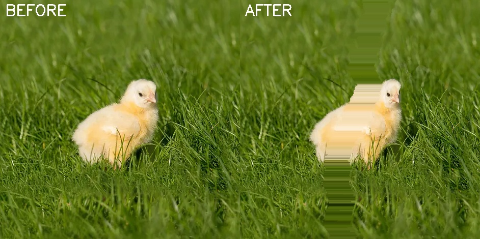

# ManuelObjectVanish: A From-Scratch Implementation of Seam Carving

[](https://www.python.org/downloads/release/python-380/)
[](https://opensource.org/licenses/MIT)

This project is a testament to first-principles problem-solving, implementing a content-aware image resizing algorithm entirely from scratch based solely on a high-level problem description. The resulting implementation remarkably converges with the fundamental principles of the renowned **Seam Carving algorithm**, independently demonstrating the logic formalized in academic literature. The core logic is built purely with **Python** and **NumPy**, showcasing a deep, practical understanding of computer vision fundamentals.

---

## Demonstration: Before & After

The algorithm intelligently identifies and removes the object specified by the mask, then reconstructs the background. The result is a clean image where the object has vanished with minimal distortion.


*Result of running `python demo.py` on the sample 'chick' image.*

---

## Core Algorithm: Seam Carving

Seam Carving is not a simple pixel deletion. It's an advanced content-aware process that removes paths of pixels (seams) with the lowest energy, preserving the most important content of the image. This project implements the full pipeline:

1.  **Energy Map Calculation (`compute_energy`)**: The significance of each pixel is quantified by calculating an "energy" value. This is derived from the image's gradients (changes in color). High-energy pixels correspond to edges and detailed textures, while low-energy pixels represent smooth areas.

2.  **Optimal Seam Identification (`find_vertical_path`)**: Using **dynamic programming**, the algorithm computes a cumulative energy matrix. This allows for the efficient identification of the "least important" connected path of pixels from the top of the image to the bottom—the seam.

3.  **Iterative Object Removal (`iterative_object_removal`)**: To remove a specific object, a binary mask is provided. The energy of the pixels within the mask is artificially set to zero, forcing the algorithm to prioritize carving seams that pass through the target object. This process is repeated until the entire object is removed.

4.  **Image Restoration (`restore_image_to_original_size`)**: After the object is carved out, the image is smaller. To restore it to its original dimensions, the algorithm reverses the process: it finds the lowest-energy seams in the modified image and duplicates them, effectively "stretching" the least noticeable parts of the image until the original width is restored.

---

## Technical Stack

*   **Language**: Python 3.8+
*   **Core Logic**: NumPy (for all numerical computing and matrix operations)
*   **Image I/O**: OpenCV (used only for reading and writing image files)

---

## Project Structure

```
ManuelObjectVanish/
├── demo.py                  # Main script to run the demonstration
├── segmentation.py          # Core implementation of the Seam Carving algorithm
├── requirements.txt         # Python dependencies
├── input/                   # Directory for input images and masks
│   ├── ball.jpg
│   ├── ball_mask.jpg
│   ├── chick.jpg
│   ├── chick_mask.jpg
│   ├── object.jpg
│   └── object_mask.jpg
└── output/                  # Directory for generated results (created automatically)
```

---

## Getting Started

### Prerequisites
- Python 3.8 or higher
- `pip` package manager

### Installation

1.  **Clone the repository:**
    ```bash
    git clone https://github.com/yourusername/ManuelObjectVanish.git
    cd ManuelObjectVanish
    ```

2.  **Install the required dependencies:**
    ```bash
    pip install -r requirements.txt
    ```

### Running the Demo

To see the project in action, simply run the `demo.py` script from the root directory:

```bash
python demo.py
```

This script will:
1.  Load the sample images and their corresponding masks from the `input/` directory.
2.  Process each image using the functions in `segmentation.py`.
3.  Save the final, object-removed images in the `output/` directory (e.g., `demo_chick_final.jpg`).
4.  Generate side-by-side comparison images (e.g., `chick_removal_comparison.jpg`) to showcase the results.

---

## Implementation Highlights for Recruiters

This project serves as a strong indicator of core software engineering and algorithmic skills relevant to **AI/ML, Data Science, and Computer Vision** roles.

*   **Algorithmic Proficiency**: The implementation of a non-trivial algorithm from a research paper using fundamental tools demonstrates a deep understanding of **dynamic programming**, **optimization**, and **image processing fundamentals**.

*   **"From Scratch" Approach**: By intentionally avoiding one-line solutions like `cv2.inpaint()`, this project proves the ability to translate complex algorithmic concepts into functional, low-level code. This is a key skill for roles that require building systems, not just using them.

*   **Performance-Conscious Coding**: The use of vectorized **NumPy** operations (e.g., in `compute_energy`) for gradient calculation showcases an understanding of efficient computation, a critical skill in performance-sensitive data processing and machine learning pipelines.

*   **Clean Code and Modularity**: The logic in `segmentation.py` is broken down into clear, single-responsibility functions (`compute_energy`, `find_vertical_path`, `remove_vertical_path`), reflecting good software engineering practices.

## License

This project is licensed under the MIT License. See the LICENSE file for details.

## Acknowledgments

*   This work was developed independently from a problem description and was later found to be a from-scratch re-implementation of the algorithm described in the paper **"Seam Carving for Content-Aware Image Resizing"** by Shai Avidan and Ariel Shamir. This highlights the project's foundational approach to algorithmic problem-solving.

## Contact

- **GitHub**: [@yourusername](https://github.com/yourusername)
- **LinkedIn**: [Your LinkedIn Profile]
- **Email**: your.email@example.com

--- 